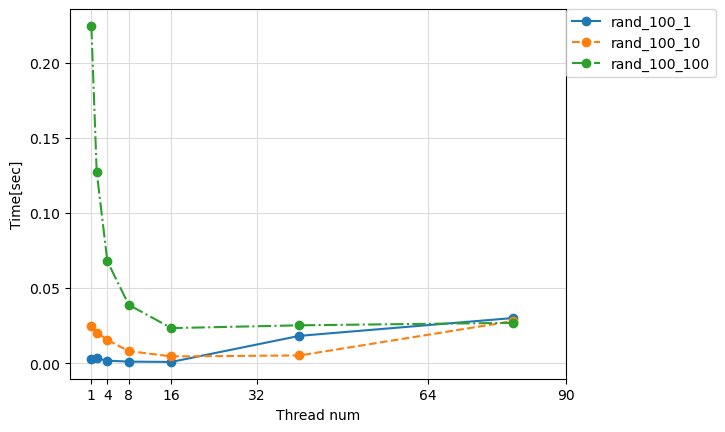
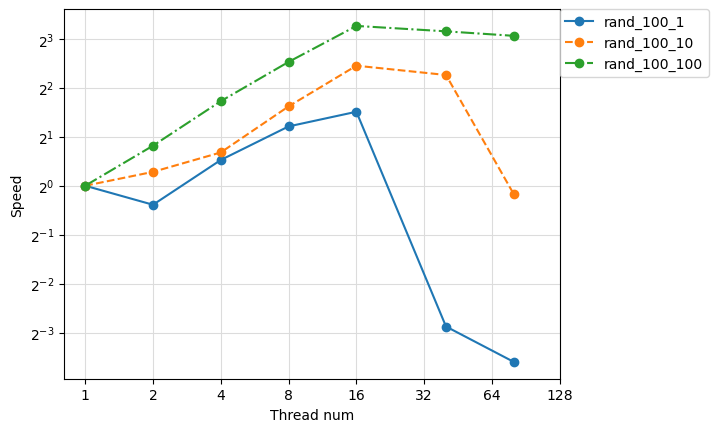
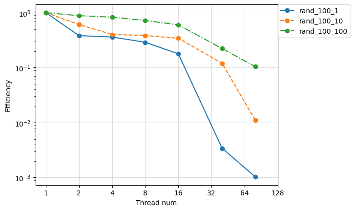
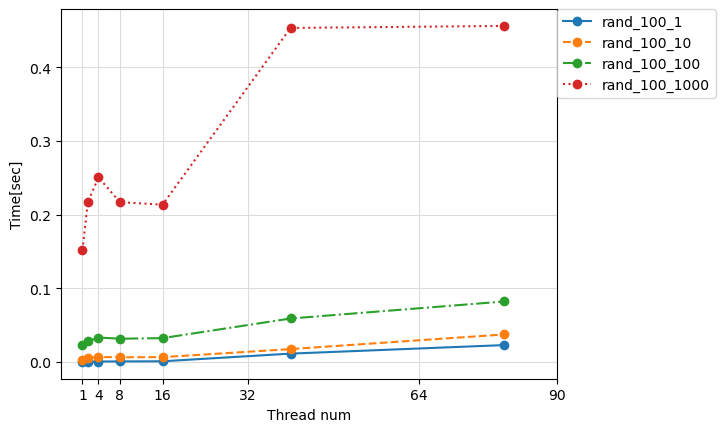
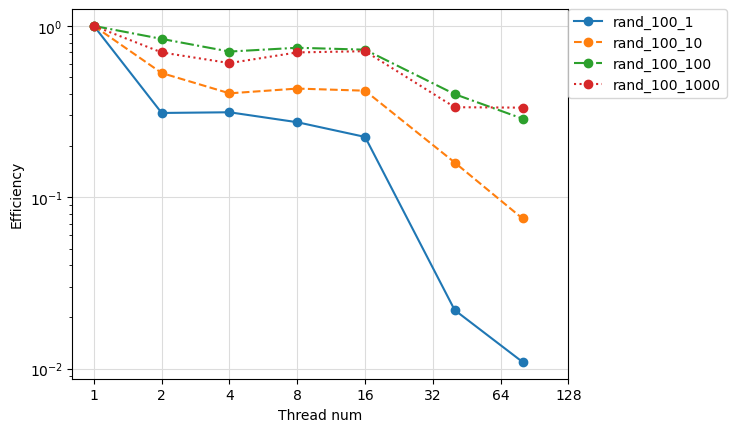

# matrix-multiplication-parallel
行列積プログラムをOpenMPを用いて並列実行し．並列数ごとの性能を実行時間，速度向上率，並列化効率で評価します．

## Usage

まずはじめに src 内で make します．
```
cd src
make
cd -
```

現在の実行環境の最大スレッド数を確認します．
```
./check_max_num_threads.sh
```
以降，最大並列数に応じてシェルスクリプトの`readonly num_threads_list="1 2 4 8 16 40 80"`を書き換えてください．  
例えば最大並列数が16の場合は`readonly num_threads_list="1 2 4 8 16"`などに書き換えてください．


行列積プログラムの簡易実行をします．
run_sample3.shはnum_threads_listを適宜書き換えてください．
```
./run_sample1.sh
./run_sample2.sh
./run_sample3.sh
```
並列数と行列積の処理にかかった時間や行列積の結果が出力されます．

並列数によるスケーリング効果をストロングスケーリング，ウィークスケーリングで評価します．
num_threads_listは適宜書き換えてください．
```
./run_test_scaling_strong.sh
./run_test_scaling_weak.sh
```
結果がoutput/scaling_strong.csv,output/scaling_weak.csvに出力されているはずです．

ストロングスケーリングとウィークスケーリングをグラフで可視化します．
```
./make_graph.sh
```
<br>
<br>
<br>
<br>

## 各指標について
１つ目の行列 $A$ の大きさを $L \times M$ ，2つ目の行列 $B$ の大きさを $M \times P$ とします．  
行列積の結果 $C$ の大きさは $L \times P$ となります．  
並列数を $N$，問題の大きさ=行列の大きさ( ループ回数 $L\times M \times P$ ) を $X$ とします．


### ストロングスケーリング
---
ストロングスケーリングでは解く問題の大きさ=行列の大きさは一定とし，並列数を変えていくことによって実行時間の減り具合を見ることが出来ます．
問題の大きさ $X$ は一定とし，並列数 $N$ を可変とします．
並列後の各プロセッサが担当する問題の大きさは $X/N$ であり， 並列数 $N$ によって変化します．

#### 実行時間
並列数 $N$　，問題の大きさが $X$ のときの実行時間 $T$ を以下のように表記します．

$$
T = T(N,X)
$$

理想的には並列数を $k$ 倍にすれば実行時間は $1/k$ 倍になるはずです．　　  

$$
T_{ideal}(N,X) = \frac{T(1,X)}{N}
$$

今回実装した単純な3重ループの行列積プログラムは計算量が $O(X)$ であり，問題の大きさ=行列の大きさを10倍にすれば実行時間はおおよそ10倍になるはずです．  

$$
T_{ideal}(N,10X) = 10T(N,X)
$$

<div align="center">

</div>
図の系列名は2つ目の行列Bの大きさを表しています．例えばrand_100_10は行列Bの大きさが 100×10 の場合を示しています．1つめの行列Aの大きさは1000×100で固定しています．

#### 速度向上率
並列数を1から $N$ に変えた場合にどれだけ実行速度が向上したかを評価するために用います．速度向上率 $S$ は以下の式で求めます．  

$$
S(N,X) = \frac{T(1,X)}{T(N,X)}
$$

例えば処理速度が1.0秒から0.5秒になった場合に速度向上率は2.0となります．  
理想的には速度向上率は並列数 $N$ となります．

$$
S_{ideal}(N,X) = \frac{T(1,X)}{T_{ideal}(N,X)} = \frac{T(1,X)}{\frac{T(1,X)}{N}} = N
$$

<div align="center">

</div>

#### 並列化効率
速度向上率をそれぞれの並列数 $N$ で除算することにより値域を $0 \sim 1$ とでき，これを並列化効率と呼びます．  

$$
E(N,X) = \frac{S(N,X)}{N}
$$

理想的には並列化効率は1となります．

<div align="center">

</div>


### ウィークスケーリング
---
ウィークスケーリングでは各プロセッサが担当する問題の大きさは一定とし，並列数に応じて問題の総量を変えていくことによって実行時間の増え具合を見ることが出来ます．
並列後の各プロセッサが担当する問題の大きさは一定とします．

$$
X/N = c
$$

並列数 $N$ のときの問題の大きさは $X_N = cN$ となるように問題を作成します．

#### 実行時間
並列数 $N$　，問題の大きさが $X$ のときの実行時間 $T$ を以下のように表記します．

$$
T = T(N,X_N)
$$

各プロセッサあたりの問題の大きさは不変なため，理想的には並列数によって実行時間は変わりません．

$$
T_{ideal}(N,X_N) = T(1,X_1)
$$

<div align="center">

</div>
図の系列名は2つ目の行列Bの大きさを表しています．例えばrand_100_10は行列Bの大きさが 100×10 の場合を示しています．
1つめの行列Aの大きさは並列数によって100×100，200×100，400×100・・・のように変化します．

#### 並列化効率
ウィークスケーリングでは実行時間の比をとると並列化効率が求まります．

$$
E(N,X) = \frac{T(1,X_1)}{T(N,X_N)}
$$

理想的には並列化効率は1となります．

$$
E_{ideal}(N,X) = \frac{T(1,X_1)}{T_{ideal}(N,X_N)} = \frac{T(1,X_1)}{T(1,X_1)} = 1
$$


<div align="center">

</div>
